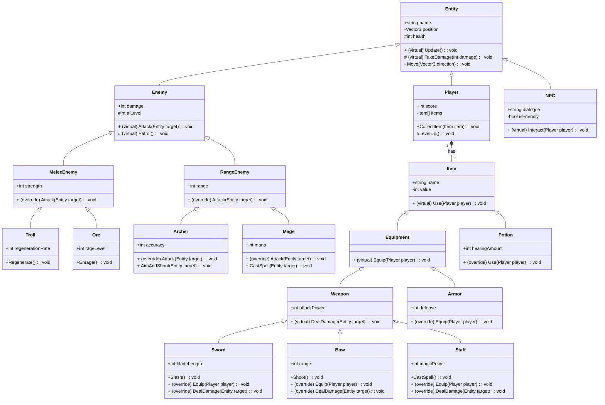

# Game Class Diagram

This document provides a textual representation of the game class diagram, including all classes, their attributes, methods, and relationships.

```mermaid
classDiagram
    class Entity {
        +string name
        -Vector3 position
        #int health
        + (virtual) Update() : void
        # (virtual) TakeDamage(int damage) : void
        - Move(Vector3 direction) : void
    }
    class Player {
        +int score
        -Item[] items
        +CollectItem(Item item) : void
        #LevelUp() : void
    }
    class Enemy {
        +int damage
        #int aiLevel
        + (virtual) Attack(Entity target) : void
        # (virtual) Patrol() : void
    }
    class MeleeEnemy {
        +int strength
        + (override) Attack(Entity target) : void
    }
    class RangeEnemy {
        +int range
        + (override) Attack(Entity target) : void
    }
    class Troll {
        +int regenerationRate
        +Regenerate() : void
    }
    class Orc {
        +int rageLevel
        +Enrage() : void
    }
    class Archer {
        +int accuracy
        + (override) Attack(Entity target) : void
        + AimAndShoot(Entity target) : void
    }
    class Mage {
        +int mana
        + (override) Attack(Entity target) : void
        + CastSpell(Entity target) : void
    }
    class NPC {
        +string dialogue
        -bool isFriendly
        + (virtual) Interact(Player player) : void
    }
    class Item {
        +string name
        -int value
        + (virtual) Use(Player player) : void
    }
    class Equipment {
        + (virtual) Equip(Player player) : void
    }
    class Weapon {
        +int attackPower
        + (virtual) DealDamage(Entity target) : void
    }
    class Sword {
        +int bladeLength
        +Slash() : void
        + (override) Equip(Player player) : void
        + (override) DealDamage(Entity target) : void
    }
    class Bow {
        +int range
        +Shoot() : void
        + (override) Equip(Player player) : void
        + (override) DealDamage(Entity target) : void
    }
    class Staff {
        +int magicPower
        +CastSpell() : void
        + (override) Equip(Player player) : void
        + (override) DealDamage(Entity target) : void
    }
    class Armor {
        +int defense
        + (override) Equip(Player player) : void
    }
    class Potion {
        +int healingAmount
        + (override) Use(Player player) : void
    }
    
    Entity <|-- Player
    Entity <|-- Enemy
    Entity <|-- NPC
    Enemy <|-- MeleeEnemy
    Enemy <|-- RangeEnemy
    MeleeEnemy <|-- Troll
    MeleeEnemy <|-- Orc
    RangeEnemy <|-- Archer
    RangeEnemy <|-- Mage
    Item <|-- Equipment
    Item <|-- Potion
    Equipment <|-- Weapon
    Equipment <|-- Armor
    Weapon <|-- Sword
    Weapon <|-- Bow
    Weapon <|-- Staff
    
    Player "1" *-- "*" Item : has
```