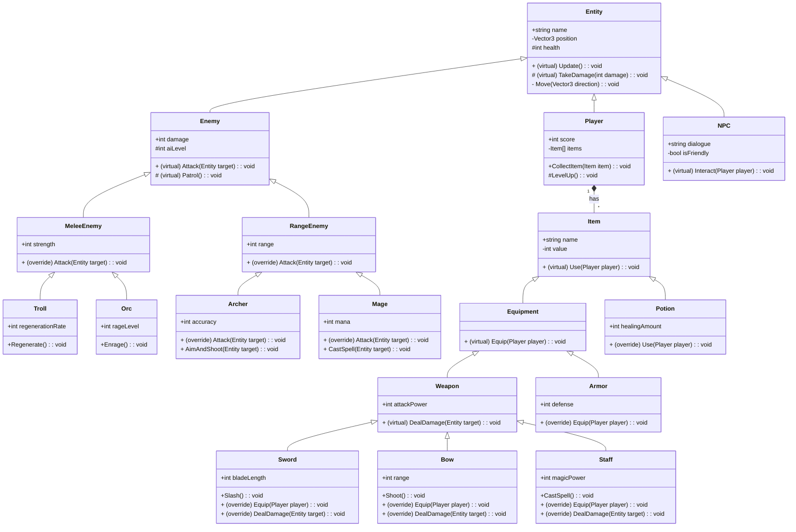

# Assignment 03: การเรียนรู้ Object-Oriented Programming และ Class Inheritance สำหรับ Game Development

## 🎯 จุดประสงค์การเรียนรู้

- เข้าใจหลักการของ Object-Oriented Programming (OOP)
- เรียนรู้การสร้างและใช้งาน Classes ใน C#
- เข้าใจแนวคิดของ Inheritance และ Polymorphism
- เรียนรู้การใช้งาน Access Modifiers (public, private, protected)
- เข้าใจการใช้งาน Virtual และ Override methods
- นำ OOP มาใช้ในการออกแบบระบบเกม
- เขียน code ที่เป็นระเบียบ อ่านง่าย และ maintainable

## 📚 โครงสร้างของ Assignment

- **Lecture Methods (5 methods)** - การ implement ฝึกหัดด้วย OOP พื้นฐาน พร้อมกันในห้องเรียน
- **Assignment Methods (21 methods)** - การประยุกต์ใช้ OOP ในระบบเกมตาม Class Diagram ที่กำหนด
- **Extra Assignment Method (0 methods)** - ไม่มีโจทย์เสริมในสัปดาห์นี้

---

## Lecture Methods

Methods เหล่านี้แสดงแนวคิด OOP พื้นฐาน Implement เพื่อฝึกหัดแต่จะไม่มีการให้คะแนน

### 1. LCT01SyntaxClass

**วัตถุประสงค์:** แสดงการประกาศและใช้งาน Class พื้นฐาน รวมถึงการสร้าง object และเรียกใช้ methods

**Implementation Required:**
สร้าง class `LCT01SyntaxClass` ใน namespace `LCT01` ที่มี method `Start()` ซึ่งจะ:
- สร้าง class ชื่อ `Car` ที่มี fields และ methods พื้นฐาน
- สร้าง instance ของ Car
- เรียกใช้ methods ของ Car object
- แสดงผลการทำงานของแต่ละ method ตามลำดับ

**Test Case:**
- **Input:** ไม่มี parameters
- **Expected Output:**
```
Car is moving
Car is turning
Car is honking
```

### 2. LCT02ClassConstructor

**วัตถุประสงค์:** แสดงการใช้งาน Constructor และการ initialize object

**Implementation Required:**
สร้าง class `LCT02ClassConstructor` ใน namespace `LCT02` ที่มี method `Start()` ซึ่งจะ:
- สร้าง class ที่มี constructor
- สร้าง object โดยใช้ constructor
- แสดงการทำงานของ constructor และ methods
- สาธิตการ initialize ค่าต่างๆ ผ่าน constructor

**Test Case:**
- **Input:** ไม่มี parameters
- **Expected Output:**
```
Buddy is barking
Buddy is wagging tail
Buddy stopped barking
```

### 3. LCT03Inheritance

**วัตถุประสงค์:** แสดงการใช้งาน Inheritance พื้นฐาน

**Implementation Required:**
สร้าง class `LCT03Inheritance` ใน namespace `LCT03` ที่มี method `Start()` ซึ่งจะ:
- สร้าง base class และ derived class
- สาธิตการสืบทอด properties และ methods
- แสดงการ override methods ใน derived class
- สร้าง objects จากทั้ง base class และ derived class

**Test Case:**
- **Input:** ไม่มี parameters
- **Expected Output:**
```
Animal Buddy is making sound
Dog Buddy is walking
Animal Twitty is making sound
Bird Twitty is flying
```

### 4. LCT04AccessModifier

**วัตถุประสงค์:** แสดงการใช้งาน Access Modifiers (public, private, protected)

**Implementation Required:**
สร้าง class `LCT04AccessModifier` ใน namespace `LCT04` ที่มี method `Start()` ซึ่งจะ:
- สร้าง class ที่มี fields และ methods ที่มี access modifiers ต่างๆ
- สาธิตการเข้าถึง members จากภายใน class และภายนอก class
- แสดงผลการทำงานของแต่ละ access level
- อธิบายความแตกต่างของแต่ละ access modifier

**Test Case:**
- **Input:** ไม่มี parameters
- **Expected Output:**
```
my name is Buddy
Buddy weak!
Buddy got 50 food
Buddy happy!
```

### 5. LCT05VirtualOverride

**วัตถุประสงค์:** แสดงการใช้งาน Virtual และ Override methods

**Implementation Required:**
สร้าง class `LCT05VirtualOverride` ใน namespace `LCT05` ที่มี method `Start()` ซึ่งจะ:
- สร้าง base class ที่มี virtual method
- สร้าง derived class ที่ override method นั้น
- สาธิต polymorphism ผ่าน method overriding
- แสดงการเรียก methods จากทั้ง base และ derived classes

**Test Case:**
- **Input:** ไม่มี parameters
- **Expected Output:**
```
Woof!
Meow!
Generic animal sound
```

---

## Assignment Methods

Methods เหล่านี้เป็นการประยุกต์ใช้ OOP ในระบบเกม และจะมีการให้คะแนนตาม Class Diagram ที่กำหนด

**สิ่งที่นักเรียนต้องทำ:** สร้างทุก class ตาม Class Diagram ข้างล่างนี้ ใน namespace `Assignment03.StudentSolution` พร้อมกับ fields, methods, และ inheritance relationships ที่ถูกต้อง




### AS01_TestAllClassesExist

**วัตถุประสงค์:** ตรวจสอบว่ามีการสร้างทุก class ตามที่กำหนดใน diagram

**สิ่งที่ต้องทำ:**
- สร้างทุก class ที่ระบุใน class diagram ใน namespace `Assignment03.StudentSolution`
- จัดการ namespace ให้ถูกต้อง
- ตรวจสอบว่าทุก class สามารถ compile ได้

**Classes ที่ต้องมี:** Entity, Player, Enemy, MeleeEnemy, RangeEnemy, Troll, Orc, Archer, Mage, NPC, Item, Equipment, Weapon, Sword, Bow, Staff, Armor, Potion

### AS02_TestEntityMembers

**วัตถุประสงค์:** ตรวจสอบ Entity class และ members ที่จำเป็น

**สิ่งที่ต้องทำ:**
สร้าง Entity class ตาม diagram ที่มี:

**Fields:**
- `public string name`
- `private Vector3 position`
- `protected int health`

**Methods:**
- `public virtual void Update()`
- `protected virtual void TakeDamage(int damage)`
- `private void Move(Vector3 direction)`

### AS03_TestPlayerMembers

**วัตถุประสงค์:** ตรวจสอบ Player class และ inheritance จาก Entity

**สิ่งที่ต้องทำ:**
สร้าง Player class ที่ inherit จาก Entity และมี:

**Fields:**
- `public int score`
- `private Item[] items`

**Methods:**
- `public void CollectItem(Item item)`
- `protected void LevelUp()`

### AS04_TestEnemyMembers

**วัตถุประสงค์:** ตรวจสอบ Enemy class และ inheritance จาก Entity

**สิ่งที่ต้องทำ:**
สร้าง Enemy class ที่ inherit จาก Entity และมี:

**Fields:**
- `public int damage`
- `protected int aiLevel`

**Methods:**
- `public virtual void Attack(Entity target)`
- `protected virtual void Patrol()`

### AS05_TestItemMembers

**วัตถุประสงค์:** ตรวจสอบ Item class และ members

**สิ่งที่ต้องทำ:**
สร้าง Item class ตาม diagram ที่มี:

**Fields:**
- `public string name`
- `private int value`

**Methods:**
- `public virtual void Use(Player player)`

### AS06_TestWeaponMembers

**วัตถุประสงค์:** ตรวจสอบ Weapon class และ inheritance จาก Equipment

**สิ่งที่ต้องทำ:**
สร้าง Weapon class ที่ inherit จาก Equipment และมี:

**Fields:**
- `public int attackPower`

**Methods:**
- `public virtual void DealDamage(Entity target)`

### AS07_TestSwordMembers

**วัตถุประสงค์:** ตรวจสอบ Sword class และ inheritance จาก Weapon

**สิ่งที่ต้องทำ:**
สร้าง Sword class ที่ inherit จาก Weapon และมี:

**Fields:**
- `public int bladeLength`

**Methods:**
- `public void Slash()`
- `public override void Equip(Player player)`
- `public override void DealDamage(Entity target)`

### AS08_TestBowMembers

**วัตถุประสงค์:** ตรวจสอบ Bow class และ inheritance จาก Weapon

**สิ่งที่ต้องทำ:**
สร้าง Bow class ที่ inherit จาก Weapon และมี:

**Fields:**
- `public int range`

**Methods:**
- `public void Shoot()`
- `public override void Equip(Player player)`
- `public override void DealDamage(Entity target)`

### AS09_TestStaffMembers

**วัตถุประสงค์:** ตรวจสอบ Staff class และ inheritance จาก Weapon

**สิ่งที่ต้องทำ:**
สร้าง Staff class ที่ inherit จาก Weapon และมี:

**Fields:**
- `public int magicPower`

**Methods:**
- `public void CastSpell()`
- `public override void Equip(Player player)`
- `public override void DealDamage(Entity target)`

### AS10_TestArmorMembers

**วัตถุประสงค์:** ตรวจสอบ Armor class และ inheritance จาก Equipment

**สิ่งที่ต้องทำ:**
สร้าง Armor class ที่ inherit จาก Equipment และมี:

**Fields:**
- `public int defense`

**Methods:**
- `public override void Equip(Player player)`

### AS11_TestPotionMembers

**วัตถุประสงค์:** ตรวจสอบ Potion class และ inheritance จาก Item

**สิ่งที่ต้องทำ:**
สร้าง Potion class ที่ inherit จาก Item และมี:

**Fields:**
- `public int healingAmount`

**Methods:**
- `public override void Use(Player player)`

### AS12_TestNPCMembers

**วัตถุประสงค์:** ตรวจสอบ NPC class และ inheritance จาก Entity

**สิ่งที่ต้องทำ:**
สร้าง NPC class ที่ inherit จาก Entity และมี:

**Fields:**
- `public string dialogue`
- `private bool isFriendly`

**Methods:**
- `public virtual void Interact(Player player)`

### AS13_TestMeleeEnemyMembers

**วัตถุประสงค์:** ตรวจสอบ MeleeEnemy class และ inheritance จาก Enemy

**สิ่งที่ต้องทำ:**
สร้าง MeleeEnemy class ที่ inherit จาก Enemy และมี:

**Fields:**
- `public int strength`

**Methods:**
- `public override void Attack(Entity target)`

### AS14_TestRangeEnemyMembers

**วัตถุประสงค์:** ตรวจสอบ RangeEnemy class และ inheritance จาก Enemy

**สิ่งที่ต้องทำ:**
สร้าง RangeEnemy class ที่ inherit จาก Enemy และมี:

**Fields:**
- `public int range`

**Methods:**
- `public override void Attack(Entity target)`

### AS15_TestTrollMembers

**วัตถุประสงค์:** ตรวจสอบ Troll class และ inheritance จาก MeleeEnemy

**สิ่งที่ต้องทำ:**
สร้าง Troll class ที่ inherit จาก MeleeEnemy และมี:

**Fields:**
- `public int regenerationRate`

**Methods:**
- `public void Regenerate()`

### AS16_TestOrcMembers

**วัตถุประสงค์:** ตรวจสอบ Orc class และ inheritance จาก MeleeEnemy

**สิ่งที่ต้องทำ:**
สร้าง Orc class ที่ inherit จาก MeleeEnemy และมี:

**Fields:**
- `public int rageLevel`

**Methods:**
- `public void Enrage()`

### AS17_TestArcherMembers

**วัตถุประสงค์:** ตรวจสอบ Archer class และ inheritance จาก RangeEnemy

**สิ่งที่ต้องทำ:**
สร้าง Archer class ที่ inherit จาก RangeEnemy และมี:

**Fields:**
- `public int accuracy`

**Methods:**
- `public override void Attack(Entity target)`
- `public void AimAndShoot(Entity target)`

### AS18_TestMageMembers

**วัตถุประสงค์:** ตรวจสอบ Mage class และ inheritance จาก RangeEnemy

**สิ่งที่ต้องทำ:**
สร้าง Mage class ที่ inherit จาก RangeEnemy และมี:

**Fields:**
- `public int mana`

**Methods:**
- `public override void Attack(Entity target)`
- `public void CastSpell(Entity target)`

### AS19_TestEquipmentMembers

**วัตถุประสงค์:** ตรวจสอบ Equipment class และ inheritance จาก Item

**สิ่งที่ต้องทำ:**
สร้าง Equipment class ที่ inherit จาก Item และมี:

**Methods:**
- `public virtual void Equip(Player player)`

### AS20_TestInheritanceRelationships

**วัตถุประสงค์:** ตรวจสอบความสัมพันธ์ของ inheritance ระหว่างทุก class

**สิ่งที่ต้องทำ:**
ตรวจสอบให้แน่ใจว่า inheritance hierarchy ถูกต้องตามนี้:

**Entity Hierarchy:**
- Entity <|-- Player, Enemy, NPC

**Enemy Hierarchy:**
- Enemy <|-- MeleeEnemy, RangeEnemy
- MeleeEnemy <|-- Troll, Orc
- RangeEnemy <|-- Archer, Mage

**Item Hierarchy:**
- Item <|-- Equipment, Potion
- Equipment <|-- Weapon, Armor
- Weapon <|-- Sword, Bow, Staff

### AS21_TestAccessModifiers

**วัตถุประสงค์:** ตรวจสอบ Access Modifiers ของทุก class members

**สิ่งที่ต้องทำ:**
ตรวจสอบให้แน่ใจว่าทุก field และ method มี access modifiers ที่ถูกต้องตามที่ระบุในแต่ละ class specification ข้างต้น:

**ตัวอย่าง:**
- Entity: name (public), position (private), health (protected)
- Player: score (public), items (private)
- Enemy: damage (public), aiLevel (protected)
- Item: name (public), value (private)
- NPC: dialogue (public), isFriendly (private)

และ virtual/override keywords ที่ถูกต้องสำหรับทุก method

---

## 📋 รายละเอียดการส่งงาน

### วิธีการส่งงาน
1. สร้าง classes ใน namespace `Assignment03.StudentSolution`
2. Implement ทุก class ตาม Class Diagram ที่กำหนด พร้อมกับ:
   - Fields ที่มี type และ access modifiers ที่ถูกต้อง
   - Methods ที่มี parameters, return types, และ access modifiers ที่ถูกต้อง
   - Inheritance relationships ที่ถูกต้อง
   - Virtual/Override keywords ที่เหมาะสม
3. Implement Lecture classes (LCT01-LCT05) ใน namespaces ที่เหมาะสม
4. ตรวจสอบให้แน่ใจว่า code สามารถ compile และ pass ทุก test case
5. จัดการ code ให้เป็นระเบียบและมี comment ที่เหมาะสม

### สิ่งที่ต้อง Implement

**Lecture Classes (ไม่มีคะแนน แต่เป็นพื้นฐานสำคัญ):**
- `LCT01.LCT01SyntaxClass` ที่มี method `Start()`
- `LCT02.LCT02ClassConstructor` ที่มี method `Start()`
- `LCT03.LCT03Inheritance` ที่มี method `Start()`
- `LCT04.LCT04AccessModifier` ที่มี method `Start()`
- `LCT05.LCT05VirtualOverride` ที่มี method `Start()`

**Assignment Classes (มีคะแนน):**
ทุก class ใน namespace `Assignment03.StudentSolution` ตาม Class Diagram

### คำแนะนำในการทำงาน
- อ่าน Class Diagram ให้เข้าใจก่อนเริ่ม implement
- เริ่มจาก base classes (Entity, Item) ก่อน
- จากนั้น implement derived classes ตามลำดับ hierarchy
- ตรวจสอบ access modifiers ให้ถูกต้อง
- ใช้ virtual/override keywords ในที่ที่เหมาะสม
- ทดสอบ code อย่างสม่ำเสมอ

### ตัวอย่าง Class Structure

```csharp
namespace Assignment03.StudentSolution
{
    public class Entity
    {
        public string name;
        private Vector3 position;
        protected int health;
        
        public virtual void Update() { }
        protected virtual void TakeDamage(int damage) { }
        private void Move(Vector3 direction) { }
    }
    
    public class Player : Entity
    {
        public int score;
        private Item[] items;
        
        public void CollectItem(Item item) { }
        protected void LevelUp() { }
    }
    
    // ... อื่นๆ ตาม Class Diagram
}
```

### การให้คะแนน
- **Lecture Methods (5 methods)**: ไม่มีคะแนน แต่เป็นพื้นฐานสำคัญ
- **Assignment Methods (21 methods)**: มีคะแนนรวมกัน
- **Code Quality**: ความสะอาดของ code, การใช้ OOP principles ที่ถูกต้อง
- **Correctness**: การ implement ที่ตรงตาม specification

---

## 🔧 เครื่องมือและเทคโนโลยี

- **ภาษาโปรแกรม**: C#
- **Framework**: Unity Engine
- **Testing Framework**: NUnit
- **Development Environment**: Visual Studio / VS Code

---

## 📚 แหล่งเรียนรู้เพิ่มเติม

- [Unity Documentation - Scripting](https://docs.unity3d.com/Manual/ScriptingSection.html)
- [C# Programming Guide - Classes](https://docs.microsoft.com/en-us/dotnet/csharp/programming-guide/classes-and-structs/)
- [Object-Oriented Programming Principles](https://en.wikipedia.org/wiki/Object-oriented_programming)

---

## ❓ คำถามที่พบบ่อย

**Q: ถ้าลืม implement method ใด method หนึ่งจะทำอย่างไร?**
A: ให้ implement method ว่างๆ ก่อน แล้วค่อยกลับมา implement logic ทีหลัง

**Q: Access modifiers สำคัญอย่างไร?**
A: Access modifiers ควบคุมการเข้าถึง data และ methods ซึ่งเป็นหลักการสำคัญของ encapsulation ใน OOP

**Q: Virtual และ Override แตกต่างกันอย่างไร?**
A: Virtual ใช้ใน base class เพื่ออนุญาตให้ derived class override, Override ใช้ใน derived class เพื่อเปลี่ยน implementation ของ base class

---

*Assignment นี้มุ่งเน้นการพัฒนาทักษะ OOP พื้นฐานสำหรับ Game Development โดยใช้ Unity Engine และ C#*
