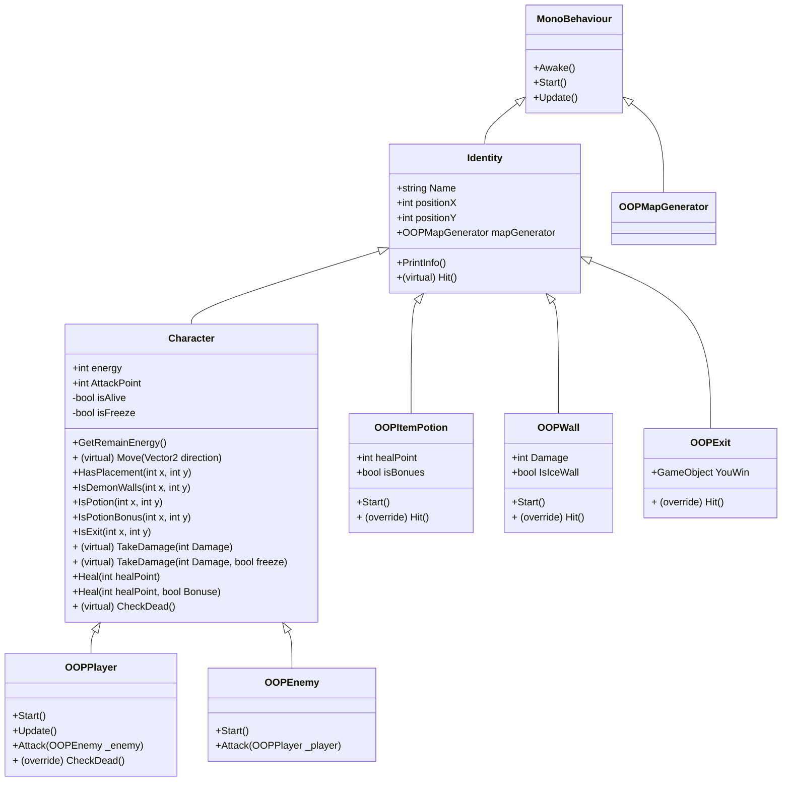

```mermaid
classDiagram
    class MonoBehaviour {
        +Awake()
        +Start()
        +Update()
    }

    class Identity {
        +string Name
        +int positionX
        +int positionY
        +OOPMapGenerator mapGenerator
        +PrintInfo()
        +(virtual) Hit()
    }

    class Character {
        +int energy
        +int AttackPoint
        -bool isAlive
        -bool isFreeze
        +GetRemainEnergy()
        + (virtual) Move(Vector2 direction)
        +HasPlacement(int x, int y)
        +IsDemonWalls(int x, int y)
        +IsPotion(int x, int y)
        +IsPotionBonus(int x, int y)
        +IsExit(int x, int y)
        + (virtual) TakeDamage(int Damage)
        + (virtual) TakeDamage(int Damage, bool freeze)
        +Heal(int healPoint)
        +Heal(int healPoint, bool Bonuse)
        + (virtual) CheckDead()
    }

    class OOPPlayer {
        +Start()
        +Update()
        +Attack(OOPEnemy _enemy)
        + (override) CheckDead()
    }

    class OOPEnemy {
        +Start()
        +Attack(OOPPlayer _player)
    }

    class OOPItemPotion {
        +int healPoint
        +bool isBonues
        +Start()
        + (override) Hit()
    }

    class OOPWall {
        +int Damage
        +bool IsIceWall
        +Start()
        + (override) Hit()
    }

    class OOPExit {
        +GameObject YouWin
        + (override) Hit()
    }

    class OOPMapGenerator {
    }

    MonoBehaviour <|-- Identity
    Identity <|-- Character
    Identity <|-- OOPItemPotion
    Identity <|-- OOPWall
    Identity <|-- OOPExit
    Character <|-- OOPPlayer
    Character <|-- OOPEnemy
    MonoBehaviour <|-- OOPMapGenerator
```
